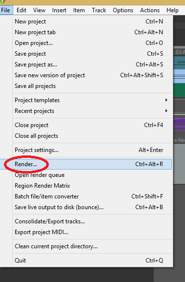

# Time to Export your work
Ready to show your friends what you can do with Reaper well you can with the exporting tool.
Here you will learn:
1. How to render a file in reaper

So it is actually quite easy to do. That is why I like Reaper so much is that it is not too difficult. So first click on *file* and then click *render...* in your Reaper window.

From there make sure that your Render page looks like mine below and then press *Render 1 file*. 

Make sure to note where you are rendering your file.
Congratulations you can now show your friends your masterpiece that you created in Reaper!
