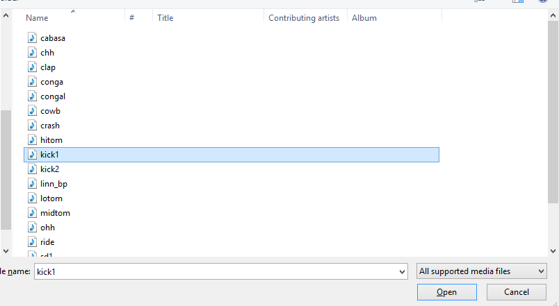

# Recording Drums
In this section we will learn how to set up our drum track and how to record drums. I will not be teaching you the basics of rhythm or musicality anywhere in this tutorial so that is on you. Here is what we will learn:
1. How to collect our drum samples
2. How to set them to our MIDI keyboard
3. How to record a track

## How to collect our drum samples.
So we made a folder in the eralier part of the tutorial where we placed our Linn LM-1 drum machine samples. This will come in handy in a second. First we need to make a new track. So do as we did on the [last page](/Track_ready.md) and creat a new track and call it *drums*. Now that you have this track created open the FX bar and click *add*. From here you need to select the ReaSamplOmatic5000 from the Sampler menu. 

Double click to open this VST.
With this now open we need to click browse in the window to find our sample. 

Take the browser to your sample directory and select the *kick 1* sample

You will now have the kick sample selected. For the purposes of this tutorial we will only be using a kick and a snare to keep things simple.

## Setting the Sample to our keyboard
Before we move on to the snare we need to set up a key for this sample to play. In the sample windo there are two boxes labeled *Note Start* and *Note End* set both of these to 60. This makes it to where when our keyboard is in normal position we play the first C key and the kick sample will play. 

Now repeat the steps above but select the *sd1* sample from the browser. So add in a new SamplOmatic5000 fx module and select the sd1 sample. For our snare drum we want it to play on the C# key (or Db) so we set the start and end note to 61. NOTE: you can pick any note you want these just work best for me and for writing. 

## How to record the track.
To start, now that we have our samples set-up to our keyboard we need to do like we did with the piano and arm the drum track. Please disarm the piano track by clicking the piano's record arm button if it is activated. With the drum track armed now select the AKM320 ---> all channels selection

Now take some time planning out a drum pattern. For a simple one, do a kick on beats 1 and 3 and snare on beats 2 and 4. Once you feel that you have a pattern to play we can move to recording it.

## Recording
This is the hardest part, but in the next section we can fix some mistakes if they come up. First turn on the metronome in the modules box above the track area. It will look like an analog metronome. Set it to the specifications below. 

Now when you are ready click the record button that is above your fader section or pres Cntrl + r and start playing the beat have two measures of metronome. Record about 4 measures of material or just 1 if you would like to loop the same thing over and over which we will get to later. 

## Nice job now you have recorded your first drum track! Time to Edit it. 
### [Editing Drums](/Editing_Drums.md)

### Other Pages
  
  [1.README](/README.md)
  
  [2.First Steps](/fs.md)
  
 [3.Track Ready](/Track_Ready.md)
 
 [4. Recording Drums](/Recording_Drums.md)
 
 [5. Editing Drums](Editing_Drums.md)
 
 [6. Recording Keys](/Recording_Keys.md)
 
 [7. Editing Keys](/Editing_Keys.md)
 
 [8. Effects](/Effects.md)
 
 [9. Exporting](/Exporting_File.md)
 
 [Closing Remarks](/Closing.md)
