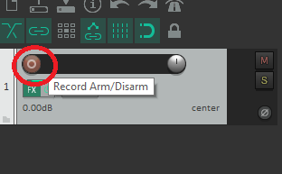

# Track Ready
Ok in this section we will get our tacks ready to record so we can move on to recording our music!
Here is what we will acomplish:
1. Creating a new track in Reaper
2. Getting our 70s VST set-up
3. Getting our keyboard ready to record

## 1. Creating a new track in Reaper
 This is really quite simple all you need to do is right click on the side pannel below the array of squares and select "Insert New Track" 
 
 This will be our piano track so you can double click the nameplate and title it *Piano*.
 Nice job on getting your new track open. Now we will get our 70s sound going.
 ## 2. Getting our 70s VST set-up
 First click on the *FX* button on the piano track.
 
 After that a new window will open. We need to click on the *Add* button at the bottom of the new window.
 
 Another new window will open and at the upper right corner click on the *FX* dropdown menu and select scan for new plugins or press F5.
 
 The *Sound of the 70s* VST should now be loaded. Double click on it in the VSTi window.
 
 This will open a new windo containg the 70s vst module. Go and click on the directory path and send it to where we placed our sound samples that we got from the 70s sight not the drum samples. This is shown below.
 
 Now that our sounds are loaded we are almost ready to start playing around with the VST. First you need to click the record arm/disarm red button on the track pannel.
 
 

### [Recording Drums](/Recording_Drums.md)
